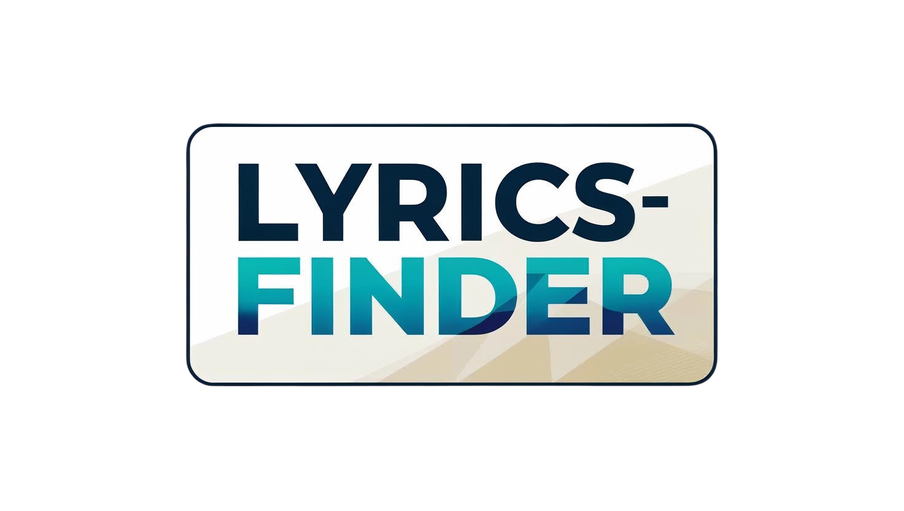

# 🎵 Lyrics Finder
I don't know about frontend, the design part was difficult :)
Readme written by cursor
A modern, responsive web application to find lyrics for your favorite songs. Built with React and styled with a Spotify-inspired theme.



## ✨ Features 

- 🎯 Quick and easy lyrics search
- 🌓 Dark/Light mode toggle with theme persistence
- 📱 Fully responsive design (mobile & desktop)
- 📋 Copy lyrics to clipboard
- 🕒 Search history with localStorage
- 💫 Beautiful background animations
- 🎨 Spotify-inspired green theme
- 🚀 Modern UI/UX with smooth transitions
- ❌ Error handling with shake animations
- 🔔 Toast notifications for feedback

## 🚀 Live Demo

[View Live Demo](https://github.com/AhmetRasB) 

## 🛠️ Technologies Used

- React.js
- CSS3 with Custom Properties (Variables)
- lyrics.ovh API
- Local Storage for data persistence
- Canvas for background animations

## 🏃‍♂️ Getting Started

1. Clone the repository:
```bash
git clone https://github.com/AhmetRasB/lyrics-finder.git
```

2. Install dependencies:
```bash
cd lyrics-finder
npm install
```

3. Start the development server:
```bash
npm start
```

4. Open [http://localhost:3000](http://localhost:3000) in your browser

## 🎯 How to Use

1. Enter the artist name in the first input field
2. Enter the song title in the second input field
3. Click "Find Lyrics" or press Enter
4. View the lyrics in the results area
5. Use the copy button to copy lyrics to clipboard
6. Toggle dark/light mode using the moon/sun icon
7. View search history using the history icon
8. Get help using the question mark icon

## 🎨 Features in Detail

### Theme Toggle
- Switch between dark and light modes
- Theme preference is saved in localStorage
- Smooth transition animations

### Search History
- Saves up to 10 recent searches
- Persists across browser sessions
- Quick re-search from history items
- Mobile-responsive sidebar

### Error Handling
- Visual feedback with shake animations
- Toast notifications for errors
- Clear error messages
- Graceful API error handling

### UI/UX Features
- Floating music note animations
- Loading spinners for feedback
- Responsive design for all screen sizes
- Smooth transitions and animations
- Copy to clipboard functionality

## 📱 Mobile Support

The application is fully responsive and provides a seamless experience on:
- 📱 Smartphones
- 📱 Tablets
- 💻 Laptops
- 🖥️ Desktop computers

## 🤝 Contributing

Contributions are welcome! Please feel free to submit a Pull Request.

## 📝 License

This project is licensed under the MIT License - see the [LICENSE](LICENSE) file for details.

## 👨‍💻 Author

**Ahmet Ras B**
- GitHub: [@AhmetRasB](https://github.com/AhmetRasB)

## 💖 Acknowledgments

- Lyrics provided by [lyrics.ovh](https://lyrics.ovh/)
- Inspired by Spotify's design system
- Thanks to all contributors and users!

## Project Structure

```
lyrics-finder/
├── public/
│   ├── icons/
│   │   └── music-icon.png
│   │   
│   ├── favicon.ico
│   ├── index.html
│   ├── logo192.png
│   ├── logo512.png
│   ├── manifest.json
│   └── robots.txt
├── src/
│   ├── assets/
│   │   └── images/
│   │       ├── logo.png
│   │       └── logo.svg
│   │   
│   ├── components/
│   │   ├── HelpModal/
│   │   │   ├── HelpModal.js
│   │   │   └── HelpModal.css
│   │   └── LyricsForm/
│   │       ├── LyricsForm.js
│   │       └── LyricsForm.css
│   │   
│   ├── App.js
│   ├── App.css
│   ├── App.test.js
│   ├── index.js
│   ├── index.css
│   ├── reportWebVitals.js
│   └── setupTests.js
├── package.json
└── package-lock.json
```

## Project Organization

- `components/`: Contains all React components, each in its own directory with associated styles
- `assets/`: Contains all static assets like images
- `public/`: Contains public assets and icons
- Root level files contain main application logic and configuration

## 📸 Preview

  


